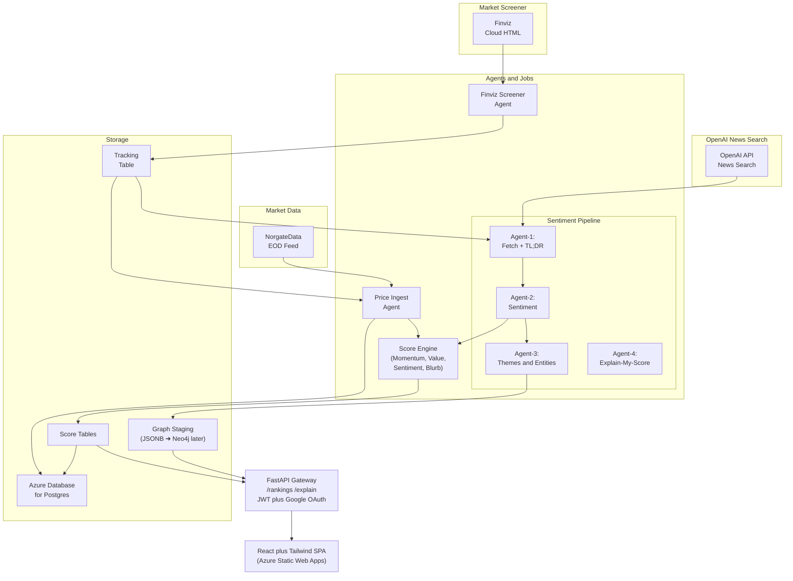

### RankAlpha.io – High‑Level Architecture (v0.3)

```mermaid
flowchart TD
  %% === Data Sources ===
  subgraph MD["Market Data"]
    ND["NorgateData
EOD Feed"]
  end
  subgraph MS["Market Screener"]
    FV["Finviz
Cloud HTML"]
  end
  subgraph ONS["OpenAI News Search"]
    OAI["OpenAI API
News Search"]
  end

  %% === Agents and Jobs ===
  subgraph AG["Agents and Jobs"]
    style AG fill:#F5F5F5 stroke:#999 stroke-width:1px
    FS["Finviz Screener
Agent"]
    PI["Price Ingest
Agent"]
    subgraph SP["Sentiment Pipeline"]
      A1["Agent‑1:
Fetch + TL;DR"]
      A2["Agent‑2:
Sentiment"]
      A3["Agent‑3:
Themes and Entities"]
      A4["Agent‑4:
Explain‑My‑Score"]
    end
    SE["Score Engine
(Momentum, Value,
Sentiment, Blurb)"]
  end

  %% === Storage ===
  subgraph ST["Storage"]
    PG["Azure Database
for Postgres"]
    TRACK["Tracking
Table"]
    SCORES["Score Tables"]
    GRAPH["Graph Staging
(JSONB ➜ Neo4j later)"]
  end

  %% === API and Frontend ===
  APIGW["FastAPI Gateway
/rankings  /explain
JWT plus Google OAuth"]
  UI["React plus Tailwind SPA
(Azure Static Web Apps)"]

  %% === Flows ===
  FV --> FS --> TRACK
  ND --> PI --> PG
  TRACK --> PI
  OAI --> A1
  TRACK --> A1
  A1 --> A2 --> A3 --> GRAPH
  A2 --> SE
  PI --> SE
  SE --> SCORES --> PG
  SCORES --> APIGW
  GRAPH --> APIGW
  APIGW --> UI

  %% === Styling ===
  classDef store fill:#dfe8f7 stroke:#2f5597 stroke-width:1px
  class PG,TRACK,SCORES,GRAPH store
  classDef agent fill:#fffbe6 stroke:#d6b656 stroke-width:1px
  class FS,PI,A1,A2,A3,A4,SE agent
  classDef api fill:#e2f5e6 stroke:#3f915f stroke-width:1px
  class APIGW,UI api
```
